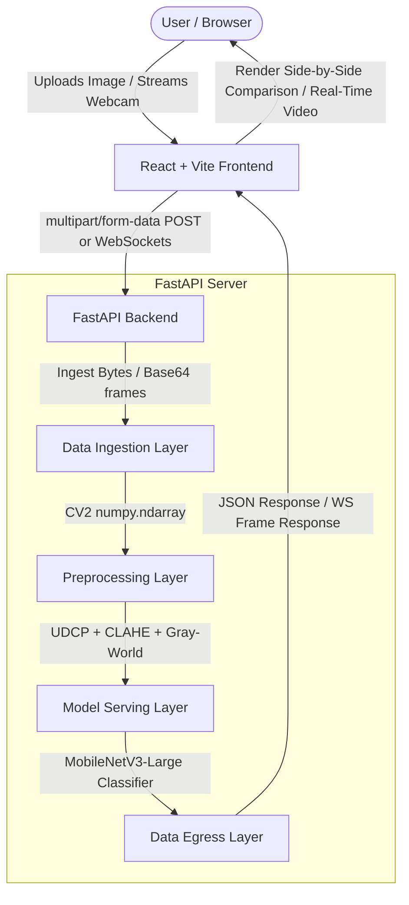
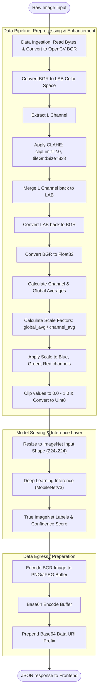

# 🌊 AquaVision — AI-Powered Underwater Image Enhancement

AquaVision is a full-stack, AI-powered underwater image enhancement and object classification platform. It transforms murky, color-distorted, and hazy underwater images into clear, high-contrast, and color-balanced visual data suitable for human inspection and marine computer vision models.

---

## 📋 Table of Contents
1. [Project Overview](#-project-overview)
2. [Key Implemented Features](#-key-implemented-features)
3. [System Architecture](#-system-architecture)
4. [Computer Vision Pipeline (Data to Inference)](#-computer-vision-pipeline-data-to-inference)
5. [Project Directory Structure](#-project-directory-structure)
6. [Setup & Installation](#-setup--installation)
7. [🚀 Running with Docker Compose](#-running-with-docker-compose)
8. [🔮 Future Recommendations](#-future-recommendations)

---

## 🔍 Project Overview

Underwater photography and videography suffer from severe image degradation due to physical properties of light propagation in water:
* **Light Attenuation**: Water absorbs different wavelengths of light at different rates. Red light is absorbed within the first 5 meters, followed by orange, yellow, and green, leaving images with a heavy blue/green tint.
* **Scattering**: Suspended particles (marine snow, plankton) scatter light, causing a characteristic "haze" or "foggy" appearance that reduces contrast and visibility.

**AquaVision** solves this by implementing a fast, robust hybrid computer vision pipeline combining **Underwater Dark Channel Prior (UDCP)** dehazing, **Contrast Limited Adaptive Histogram Equalization (CLAHE)**, and a **Gray-World Color Correction Model** to reconstruct the visual details and color profile of underwater scenes.

---

## ✨ Key Implemented Features

1. **Dockerized Decoupled Deployment**: Fully containerized frontend (built with Node.js and served via Nginx) and backend (FastAPI) orchestrated via Docker Compose.
2. **Deep Learning Model Serving**: Native integration of PyTorch and Torchvision, using a pre-trained **MobileNetV3-Large** model to classify enhanced underwater visual feeds.
3. **Advanced Preprocessing (UDCP)**: Implemented **Underwater Dark Channel Prior (UDCP)** and a custom **Guided Filter** to perform physical underwater dehazing, combined with CLAHE and Gray-World color white balance.
4. **Real-Time Video Enhancement**: Built a low-latency, bidirectional **FastAPI WebSocket** server for processing and enhancing video feeds from a client webcam at 10-12 FPS, with active client controls to toggle pipeline features in real-time.

---

## 🏗️ System Architecture

AquaVision utilizes a decoupled frontend-backend architecture:



### Component Details
1. **Frontend (React + Vite)**:
   * Styled with modern, high-fidelity Tailwind CSS supporting Dark/Light modes.
   * Utilizes **Framer Motion** for micro-interactions and smooth page transitions.
   * Leverages **Lucide React** for premium iconography.
   * Communicates asynchronously with the backend server via HTTP fetch and native WebSockets.
2. **Backend (FastAPI)**:
   * Light-weight, high-performance web framework for building APIs with Python.
   * Uses **OpenCV** (`opencv-python`) and **NumPy** for vector-accelerated image manipulation operations.
   * Uses **PyTorch** and **Torchvision** for pre-trained deep learning inference.

---

## ⚙️ Computer Vision Pipeline (Data to Inference)

The core strength of AquaVision lies in its step-by-step data processing and enhancement flow. The pipeline operates as follows:



### Detailed Pipeline Stages

#### 1. Data Ingestion Layer
* The REST endpoint `/api/enhance-image` and WebSocket endpoint `/api/stream-enhance` receive raw or base64 image data.
* The backend decodes the data into a PIL image and converts it into a NumPy array inside the BGR color space for OpenCV.

#### 2. Preprocessing / Attenuation Correction (The Enhancement Engine)
The preprocessing engine in [main.py](file:///c:/Users/bhawu/Documents/GitHub/aqua-vision/aqua-vision-backend/main.py#L136-L200) addresses both scattering (contrast) and light absorption (color shift) in sequence:

* **Underwater Dark Channel Prior (UDCP) Dehazing**:
  1. Computes the minimum intensity channel among Blue and Green channels:
     $$J^{\text{UDCP}}(x) = \min_{y \in \Omega(x)} \left( \min_{c \in \{G, B\}} J^c(y) \right)$$
  2. Estimates background waterlight ($A$) from the top 0.1% brightest pixels in the UDCP map.
  3. Formulates the transmission map $t(x)$ and refines it using a custom-implemented **Guided Filter** to preserve edges and prevent halo boundaries.
  4. Restores scene radiance:
     $$J(x) = \frac{I(x) - A}{t(x)} + A$$

* **Contrast Limited Adaptive Histogram Equalization (CLAHE)**:
  1. The BGR image is converted to the **CIE L\*a\*b\*** color space, which decouples luminance/lightness ($L$) from chromaticity/color channels ($a$ and $b$).
  2. Contrast enhancement is performed *only* on the L channel using CLAHE with a clip limit of 2.0 and a grid size of 8x8. This improves visibility and contrast under low-light/hazy conditions without introducing color distortion.
  3. The L channel is merged back, and the LAB image is converted back to BGR.

* **Simple Gray-World Color Correction (White Balance)**:
  1. Water acts as a natural color filter, absorbing red wavelengths. To compensate, a Gray-World color normalization algorithm is applied.
  2. The pixel values are normalized to a floating-point range $[0.0, 1.0]$.
  3. The average intensities of the individual channels are calculated:
     $$\mu_B = \text{avg}(B), \quad \mu_G = \text{avg}(G), \quad \mu_R = \text{avg}(R)$$
  4. The global average across all three channels is calculated:
     $$\mu_{\text{all}} = \frac{\mu_B + \mu_G + \mu_R}{3}$$
  5. If the channel averages are non-zero, scale factors are computed to normalize each channel to the global average:
     $$S_B = \frac{\mu_{\text{all}}}{\mu_B}, \quad S_G = \frac{\mu_{\text{all}}}{\mu_G}, \quad S_R = \frac{\mu_{\text{all}}}{\mu_R}$$
  6. The scale factors are multiplied with the respective channels, correcting the blue-green shift by boosting the attenuated red channel.
  7. The pixel values are clipped to $[0.0, 1.0]$ to prevent saturation artifacts and converted back to unsigned 8-bit integers (`uint8`).

#### 3. Model serving / Inference Layer
* Utilizes **MobileNetV3-Large** loaded onto cpu/cuda.
* Enhanced frames are resized to $224 \times 224$, normalized using ImageNet channel means (`[0.485, 0.456, 0.406]`) and standard deviations (`[0.229, 0.224, 0.225]`), and processed.
* Output classes are mapped to human-readable names using dynamically-cached labels from the PyTorch repository.

#### 4. Data Egress Layer
* The enhanced BGR image is compressed (lossless PNG for uploads, lightweight JPEG for high-frame-rate WebSocket streaming).
* The binary buffer is converted to a base64 string and formatted as a Data URI scheme:
  `data:image/png;base64,...`
* A JSON payload with the Data URI, processing time, classification label, and confidence score is returned to the client.

---

## 📁 Project Directory Structure

```text
aqua-vision/
├── docker-compose.yml              # Multi-container orchestration config
├── README.md                       # Root documentation (this file)
├── aqua-vision-backend/            # Backend (FastAPI + OpenCV + PyTorch)
│   ├── main.py                     # API routes, WS connection, PyTorch MobileNetV3 loading & UDCP
│   ├── requirements.txt            # Python dependencies
│   └── Dockerfile                  # Slim Python base image config
└── aqua-vision-frontend/           # Frontend (React + Vite)
    ├── package.json                # npm dependencies & script configuration
    ├── index.html                  # Core HTML file
    ├── vite.config.js              # Vite configuration
    ├── nginx.conf                  # Nginx production proxy & SPA router config
    ├── Dockerfile                  # Multi-stage production build configuration
    └── src/
        ├── App.jsx                 # Page state router and dark mode controller
        ├── index.css               # Global Tailwind directives
        ├── components/
        │   ├── Navbar.jsx          # Header navigation bar (updated with Live Stream)
        │   └── Toast.jsx           # Notification toast component
        ├── pages/
        │   ├── HomePage.jsx        # Landing page UI
        │   ├── UploadPage.jsx      # File upload handler & drop zone
        │   ├── ResultsPage.jsx     # Side-by-side comparative viewer
        │   ├── LiveStreamPage.jsx  # Real-time WebSocket camera stream interface
        │   └── AboutPage.jsx       # About us page and upcoming roadmap
        └── services/
            └── api.js              # Fetch layer to make API calls to backend
```

---

## 🚀 Setup & Installation

### Prerequisites
* **Backend**: Python 3.10+
* **Frontend**: Node.js 18+

### 1. Run Backend Server
```bash
cd aqua-vision-backend
python -m venv .venv
# On Windows (PowerShell)
.venv\Scripts\Activate.ps1
# On Linux/macOS
source .venv/bin/activate

pip install -r requirements.txt
python main.py
```
*Backend API will run at `http://localhost:8000`.*

### 2. Run Frontend Server
```bash
cd aqua-vision-frontend
npm install
npm run dev
```
*Frontend Dev Server will run at `http://localhost:5173`.*

---

## 🐳 Running with Docker Compose

Running the entire stack inside containers is extremely simple:

```bash
docker-compose up --build
```

* **Frontend**: `http://localhost:3000`
* **Backend**: `http://localhost:8000`

---

## 🔮 Future Recommendations

To scale AquaVision to a production-grade commercial platform:
1. **Marine-Specific Classifiers**: Replace standard ImageNet weights with a custom YOLOv8 model trained specifically on marine organisms (e.g., *TrashCan* or *FishPak* datasets) to detect corals, underwater debris, and distinct fish species.
2. **GPU Acceleration in Containers**: Update backend Dockerfile and Compose setup to utilize NVIDIA Container Toolkit (`nvidia/cuda` base image) for running high-throughput PyTorch model inference on GPU hardware.
3. **Advanced Attenuation Modeling (Sea-thru)**: Integrate physical water light propagation modeling (attenuation coefficient matrices) based on estimated water depths.